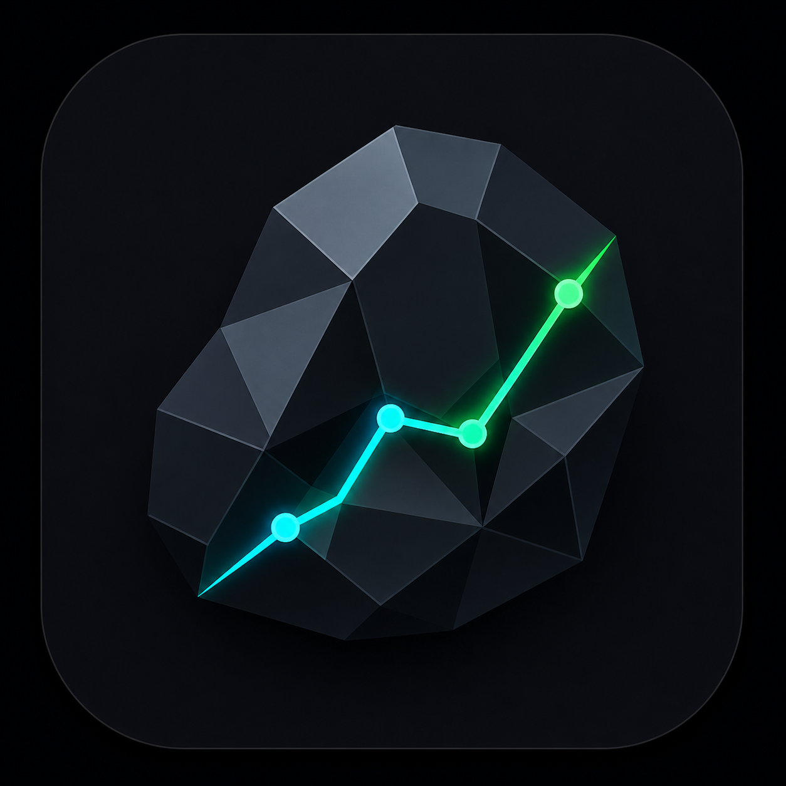

<div align="center">
  
  
  # Gravel Finance

  ✨ Um sistema operacional financeiro pessoal com dados bancários (Pluggy Open Finance), crypto (Binance), revisão operacional e explicabilidade de cálculos.
</div>

<br />

Construído com **Next.js 16**, **React 19**, **Prisma** e **SQLite** — uma arquitetura *local-first*, sem dependências de serviços SaaS externos além dos provedores de dados. O Gravel evoluiu de dashboard para Finance OS: explica números, abre drill-downs consistentes, gera Inbox financeira e conduz fechamento do mês.

---

## 🚀 Tech Stack

- **Frontend**: Next.js 16 (App Router), React 19, TypeScript, Tailwind CSS v4, shadcn/ui, Recharts, d3-sankey
- **Estado / Cache**: TanStack Query (com persist em localStorage — stale-while-revalidate, abre instantâneo offline)
- **Navegação**: `next-view-transitions` (cross-fade nativo entre rotas, Safari 18+/Chrome 111+)
- **Backend**: Next.js API Routes, Prisma ORM
- **Banco de Dados**: SQLite (arquivo único, zero dor de cabeça)
- **Integrações**: Pluggy (Open Finance BR), Binance (Crypto)
- **Resiliência**: retries exponenciais nas cotações USD/BRL; banner de falha de sync lendo `OpsSyncRun`
- **Testes**: Vitest (Unit)
- **Deploy**: Dockerfile multi-stage (imagem autossuficiente ~470MB)

---

## 🛠️ Setup Rápido

1. **Instale as dependências:**
   ```bash
   pnpm install
   ```

2. **Configure o banco local:**
   ```bash
   cp .env.example .env   # preencha as variáveis necessárias
   pnpm db:push
   ```

3. **Inicie o servidor de desenvolvimento:**
   ```bash
   pnpm dev
   ```

---

## ⚙️ Variáveis de Ambiente

Consulte o arquivo `.env.example`. Um resumo das principais configurações:

```env
DATABASE_URL="file:./dev.db"

# Pluggy (Open Finance)
PLUGGY_CLIENT_ID=
PLUGGY_CLIENT_SECRET=

# Binance
BINANCE_API_KEY=
BINANCE_API_SECRET=

# Protege os endpoints internos em /api/admin/*
INTERNAL_API_KEY=
```

---

## 📜 Comandos Disponíveis

| Comando | Descrição |
|---------|-----------|
| `pnpm dev` | Servidor de desenvolvimento. |
| `pnpm build` | Build de produção (modo standalone) e cópia de assets para `.next/standalone`. |
| `pnpm start` | Inicia o build standalone gerado por `pnpm build`. |
| `pnpm lint` | Executa o ESLint. |
| `pnpm test` | Testes unitários (Vitest). |
| `pnpm test:watch` | Testes em modo watch. |
| `pnpm db:push` | Sincroniza o schema do Prisma com o SQLite. |
| `pnpm db:migrate` | Gera uma migration do banco de dados. |
| `pnpm gravel` | Ferramenta de CLI local (`doctor`, `snapshot`, `diff`, `ops`, `project`, `review`). |

---

## 📚 Documentação

- 🌟 [Funcionalidades](docs/features.md) — Visão detalhada de todas as telas e recursos.
- 🏗️ [Arquitetura](docs/architecture.md) — Camadas, esquema de dados e fluxo da aplicação.
- 📖 [API Reference](docs/api-reference.md) — Endpoints e exemplos de requisição.
- 🔌 [Integração Pluggy](docs/pluggy.md) — Detalhes do Open Finance.
- 🧪 [Pluggy Trial e Sandbox](docs/pluggy-trial-guide.md) — Como testar sem plano pago.
- 🪙 [Integração Binance](docs/binance.md) — Detalhes da sincronização de criptomoedas.
- 🖥️ [CLI](docs/cli.md) — Guia da linha de comando do Gravel.

---

## 🤖 Gravel CLI (Integração de IA)

Uma CLI nativa desenvolvida para diagnóstico e empacotamento de dados financeiros para consumo rápido e estrito por LLMs (ChatGPT/Claude).

```bash
# Diagnóstico de saúde do sistema
pnpm gravel doctor

# Snapshot otimizado para colar num chat com LLM
pnpm gravel snapshot finance --for-llm

# Comparar dois snapshots
pnpm gravel diff ./before ./after

# Inbox financeira e fechamento do mês
pnpm gravel review inbox
pnpm gravel review monthly-close --month 2026-06
```

Para mais comandos, consulte o [Guia da CLI](docs/cli.md).

---

## 🐳 Docker (Deploy Homelab)

O projeto utiliza um Dockerfile multi-stage baseado no modo `standalone` do Next.js. O Prisma CLI é embarcado na imagem para aplicar schemas no primeiro boot.

### Docker Compose (Recomendado)

A maneira mais rápida de rodar a aplicação em produção:

```bash
docker compose up --build -d
```

O `docker-compose.yml` criará um volume nomeado (`gravel_data`) para proteger o arquivo SQLite, definirá healthchecks HTTP e setará o banco em `/app/data/prod.db`.

### Docker Puro

```bash
docker build -t gravel .

docker volume create gravel_data

docker run -p 3000:3000 \
  -e DATABASE_URL="file:/app/data/prod.db" \
  -e PLUGGY_CLIENT_ID="..." \
  -e PLUGGY_CLIENT_SECRET="..." \
  -v gravel_data:/app/data \
  gravel
```

> **Dica de Permissões:** Caso opte por um bind mount local (`-v ./data:/app/data`), certifique-se de que o diretório pertence ao usuário de ID `1001` (aplicando um `chmod`), uma vez que o container roda usando um usuário não-root por segurança.

---

## 📈 Status de Validação

- `pnpm exec tsc --noEmit` — checagem de tipos global.
- `pnpm exec eslint ...` — lint focado nas telas e rotas alteradas.
- Validação HTTP manual cobre dashboard, transações, categorias, contas, faturas, portfólio, relatórios, configurações, conexões, Inbox e fechamento mensal.

---

## ✨ Destaques Recentes

- 🧾 **Composição dos KPIs**: cards principais explicam fórmula, inclusões, exclusões, fonte e drill-down exato.
- 📥 **Inbox Financeira**: central acionável para categorias incertas, faturas próximas, salário não confirmado, conexões atrasadas e metas em risco.
- ✅ **Fechamento do Mês**: checklist operacional para revisar receitas, transferências, faturas, categorias, recorrências e metas.
- 🔌 **Conexões Humanas**: instituições com status, última sincronização, contas/importações e UUID apenas em detalhes técnicos.

---

## 🪨 Por que "Gravel"?

O nome "Gravel" (*cascalho* em inglês) é um easter egg da minha época de escola em Sardoá. Como o próprio nome da cidade significa "Toá" (uma pedra de origem indígena), a escola criou uma moeda com esse nome para premiar os alunos.

A piada interna era inevitável: *"Rapaz, eu nunca vi essa peste de toá... a única coisa que tem nas ruas dessa cidade é cascalho!"*. O apelido pegou e o dinheiro da escola virou "cascalho". Anos depois, a brincadeira virou o nome deste projeto pessoal, focado em gerenciar o "cascalho" da vida adulta.
